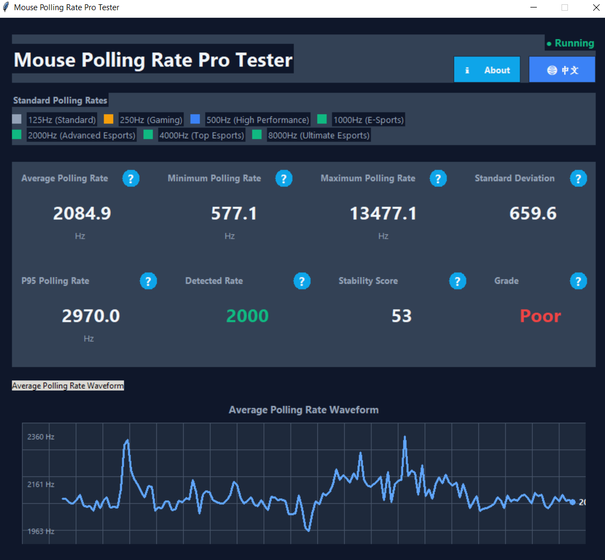

# 🐭 Mouse Polling Rate Pro Tester

🌍 **Language**
- [English](README.md)
- [简体中文](README.zh-CN.md)

[](https://www.python.org/)
[](https://opensource.org/licenses/MIT)
[](#)
[](#)

**Professional USB Mouse Polling Rate Tester**  
Breaks browser limitations and measures real system-level raw input data.


*Professional GUI with real-time polling rate visualization and waveform analysis*

---

## 📋 Table of Contents
- [✨ Key Features](#-key-features)
- [🎯 Why This Tool?](#-why-this-tool)
- [📊 Technical Specifications](#-technical-specifications)
- [🚀 Quick Start](#-quick-start)
- [🔧 Usage](#-usage)
- [📈 Metrics Explained](#-metrics-explained)
- [🖥️ System Requirements](#️-system-requirements)
- [📁 Project Structure](#-project-structure)
- [🤝 Contributing](#-contributing)
- [📄 License](#-license)
- [🙏 Acknowledgements](#-acknowledgements)

---

## ✨ Key Features

### 🎯 Accurate Measurement
- **True USB polling rate detection** — bypasses browser limitations and accesses the system HID layer directly
- **Nanosecond-level timing precision** using `time.perf_counter_ns()`
- **Intelligent outlier filtering** to ensure stable and reliable results

### 📊 Professional Analysis
- **Automatic polling rate detection**  
  Supports 125 / 250 / 500 / 1000 / 2000 / 4000 / 8000 Hz
- **Stability scoring system**  
  Rated as *Excellent / Good / Fair / Poor*
- **Comprehensive metrics**  
  Mean, Min, Max, Standard Deviation, P95, and jitter analysis

### 🎨 Modern Interface
- **Real-time waveform visualization** of polling rate fluctuations
- **Multi-language UI** (English / Chinese)
- **Dark theme** with an esports-oriented professional design
- **Contextual help** with detailed explanations for every metric

### 🔧 Advanced Capabilities
- **Raw input capture** via system-level APIs
- **600-sample analysis window** for statistically meaningful results
- **150-point waveform rendering** for smooth real-time visualization
- **200 ms update interval** balancing responsiveness and performance

---

## 🎯 Why This Tool?

### 🔍 Limitations of Browser-Based Tests
Most web-based mouse testing tools are limited by:
- **Browser event throttling** tied to display refresh rates
- **No access to USB HID raw data**
- **Hard frequency limits**, typically capped at 60–240 Hz

### 🚀 Advantages of a Native Desktop Tool
This application provides:
- **True hardware-level polling rate measurement**
- **Support for ultra-high polling rates** up to 8000 Hz
- **System-level access** without browser or OS abstraction limits
- **Esports-grade performance analysis**

### 📊 Comparison

| Feature | Browser Tools | This Tool |
|------|---------------|-----------|
| **Data Source** | Browser events (`mousemove`) | System raw input (HID) |
| **Maximum Accuracy** | ≈ Monitor refresh rate | True USB polling rate |
| **Supported Rates** | 60–240 Hz | 125–8000 Hz |
| **Latency Analysis** | Not possible | Nanosecond precision |
| **Stability Evaluation** | Basic | Professional scoring |

---

## 📊 Technical Specifications

### 🎛️ Sampling Parameters

| Parameter | Value | Description |
|---------|------|-------------|
| Sample window | 600 data points | Large historical buffer for accuracy |
| Waveform display | 150 averaged points | Real-time visualization |
| Update interval | 200 ms | Balanced performance |
| Time resolution | Nanoseconds | `perf_counter_ns()` |

### 📈 Supported Polling Rates

| Polling Rate | Typical Devices | Report Interval | Use Case |
|-------------|----------------|-----------------|---------|
| 125 Hz | Office mice | 8 ms | Office work |
| 250 Hz | Entry-level gaming mice | 4 ms | Casual gaming |
| 500 Hz | Mid-range gaming mice | 2 ms | General gaming |
| 1000 Hz | High-end esports mice | 1 ms | Competitive gaming |
| 2000 Hz | Advanced esports mice | 0.5 ms | Professional esports |
| 4000 Hz | Flagship esports mice | 0.25 ms | Elite esports |
| 8000 Hz | Ultra-high-end mice | 0.125 ms | Extreme performance |

### 📊 Evaluation Metrics

1. **Mean** – Average polling rate
2. **Minimum** – Lowest observed polling rate
3. **Maximum** – Highest observed polling rate
4. **Standard Deviation** – Polling rate stability
5. **P95** – Value exceeded by 95% of samples
6. **Stability Score** – Composite score (0–100)
7. **Grade** – Excellent / Good / Fair / Poor

---

## 🚀 Quick Start

### Prerequisites
- Python 3.8 or newer
- pip package manager

### Installation

```bash
# 1. Clone the repository
git clone https://github.com/liupanfengstarrysky/mouse-polling-rate-tester.git
cd mouse-polling-rate-tester

# 2. Install dependencies
pip install -r requirements.txt

# 3. Run the application
python mouse_polling_gui_pro.py

🔧 Packaging
# 1. Install auto-py-to-exe
pip install auto-py-to-exe

# 2. Launch the packaging GUI
python -m auto_py_to_exe
```
🔗 **Online Mouse Test (Web Version)**  
For quick validation or sharing results, you can also use the browser-based tester:  
👉 https://starryring.com/toolbox/mouse/pollingrate/

> Note: Due to browser limitations, the web version cannot access raw USB HID data.
> For accurate polling rate measurement, use this desktop tool.


